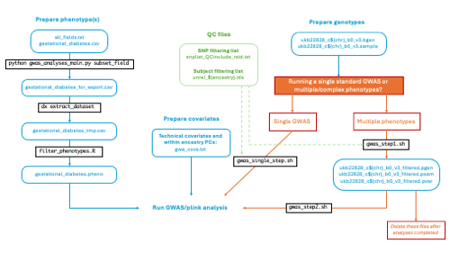

Author: Tanya Phung (t.n.phung@vu.nl) & Jeanne Savage

This document is intended to guide how to do a GWAS on the UKB-RAP platform. For demonstrational purposes, the trait we will be using is gestational diabetes (field ID 4041).

## Table of contents
* [Schematic of steps to run GWAS](#schema)
* [Step 1: Prepare phenotype file](#step1)
* [Step 2: Prepare covariates and QC files](#step2)
* [Step 3: Run GWAS](#step3)
* [Step 4: Merge and subset results](#step4)


## Schematic of steps to run GWAS <a name="schema"></a>



## Step 1: Prepare phenotype file <a name="step1"></a>

Create a PLINK format phenotype file for analysis. This can be done in many ways; see [export_phenotypes.md](https://github.com/vu-ctg/ukb_rap_workflows/blob/master/common_tasks/export_phenotypes.md) for an overview. 

In this case, we will carry out the next steps using the JupyterHub tool on the UKB RAP website. Log in to your RAP account and launch a new JupyterLab job (Tools >> JupyterLab) from the appropriate project and with the necessary computing resources. Once the job has launched, open a new Terminal window and download the necessary scripts/input files:

```
dx download project-GgbZPkjJ2JG1kB92GKyB7Zb5:/gwas_scripts/*
```

Then follow the steps below to create the PLINK phenotype file for gestational diabetes and run the GWAS analysis. All steps except 1a should be run within the RAP JupyterLab as they involve files with individual-level data.

#### Step 1a: Prepare the list of phenotype fields to use as an input file for the `dx extract_dataset` command

- Script: `gwas_analyses_main.py`
- Required inputs: 
    - `all_fields.txt`
        - This file can be generated with the command: `dx extract_dataset {projectID}:{recordID} --list-fields > all_fields.txt`
    - A file (for example: `gestational_diabetes.csv`) where the header is `FieldID` and each row contains the field ID of the phenotypes you wish to extract. The first row should be `participant.eid`

- Example command:
    ```
    python gwas_analyses_main.py subset_field \
        --all_fields all_fields.txt \
        --fields_interest gestational_diabetes.csv \
        --outfile gestational_diabetes_for_export.txt 
    Subset the file all_fields.txt and format to be used as an input file to dx extract_dataset --fields-file
    ```

- Output of this script is `gestational_diabetes_for_export.txt`
```
cat gestational_diabetes_for_export.txt 
participant.eid
participant.p4041_i0
participant.p4041_i1
participant.p4041_i2
participant.p4041_i3
```

#### Step 1b: Run `dx extract_dataset` to extract data for each phenotype
If needed, change the {projectID}:{recordID} to your own.

```
dx extract_dataset project-GgbZPkjJ2JG1kB92GKyB7Zb5:app16406_20251123031339.dataset --fields-file gestational_diabetes_for_export.txt --output gestational_diabetes_tmp.csv

```

#### Step 1c: Keep only individuals with valid phenotypic data
- From https://biobank.ndph.ox.ac.uk/showcase/field.cgi?id=4041, we keep instance 0 (first in-person assessment center visit) and only when the response is No (0) or Yes (1), not missing/DNA
- Rscript: `filter_phenotypes.R`. This script also converts values for cases from 1 to 2 and values for controls from 0 to 1

```
data = fread("gestational_diabetes_tmp.csv")

i0 = data %>% 
  filter(participant.p4041_i0==0 | participant.p4041_i0==1) %>%
  select(participant.eid, participant.p4041_i0) %>%
  mutate(IID = participant.eid) %>%
  select(participant.eid, IID, participant.p4041_i0)

colnames(i0) = c("FID", "IID", "GestationalDiabetes")

i0$GestationalDiabetes[i0$GestationalDiabetes == 1] <- 2
i0$GestationalDiabetes[i0$GestationalDiabetes == 0] <- 1

write.csv(i0, "gestational_diabetes.pheno", quote = F, row.names = F)
```
- Check to make sure that the number matches with the website (may differ slightly due to participant withdrawals): 
```
table(i0$GestationalDiabetes)

   1    2 
8472 1069 
```

## Step 2: Prepare the covariate and QC files  <a name="step2"></a>
The necessary files for running most GWAS analyses can be found on the CTG-UKB shared project:
- Standard covariates (age, sex, array, batch, assessment center) and within-ancestry principal components generated by CTG: `/gwa_covs.txt`
- QC passing SNPs: `/Variant Lists/snplist_QCinclude_rsid.txt`
- QC passing (unrelated) individuals: `/Subject Lists/unrel_${ancestry}.ids` (where ${ancestry} is one of AFR/AMR/EAS/EUR/SAS ancestry subgroups (or `full_${ancestry}.ids` if you want relatives included)
Additional files or covariates may need to be generated by the user, depending on the analysis parameters.


## Step 3: Run GWAS (or other plink analysis) <a name="step3"></a>
Standard GWAS analysis following our pipeline will take UKB bgen files as input (`ukb22828_c${chr}_b0_v3.[bgen/sample]`), convert these to plink-format files with hardcalled genotypes, and then run the plink analysis specified by the user. Depending on the analysis, it may be more convenient and cost-effective to either run the conversion+GWAS in a single step or as two separate steps. Considerations are the cost of storing the (large) genotype files, which must be removed manually by the user, versus the cost of computing time to regenerate them for each analysis (including likelihood of getting kicked from low priority jobs for longer analyses). Generally, the best approach on the RAP is to have many small/short jobs (<1hr) rather than fewer longer jobs. We therefore provide two options for running GWAS following this pipeline:
A. Convert files + run GWAS in a single step with [`gwas_single_step.sh`](gwas_single_step.sh). This costs ~£2-3 to run a GWAS on a single quantitative phenotype, and is the best option for a one-off analysis.
B. Convert files with [`gwas_step1.sh`](gwas_step1.sh), which will store the converted plink files in your local project, then use these files as input for one or more GWASs using [`gwas_step2.sh`](gwas_step2.sh) - making sure you manually delete the large genotype files when they are no longer needed. This is the best option when you want to run a GWAS with multiple phenotypes, or multiple different GWAS/plink analyses in succession.

For a cost comparison of different options and computing instances, please see our test results in the file [`ukb_rap_cost_comparison_gwas.xlsx`](ukb_rap_cost_comparison_gwas.xlsx). Note that these costs are not exactly replicable as they depend on computing instance, priority of the job, and number of restarts of job (if low/normal priority), which is highly dependent on the load on the server at the time of job submission. Jobs are less likely to be interrupted if submitted in the evenings and weekends compared to peak office hours.


## Step 4: Merge and subset results files <a name="step4"></a>
After running the GWAS/plink analyses in parallel across chromosomes, merge the result files and create a single (reduced) summary statistics file for download and external analyses using [`merge_results.sh`](merge_results.sh).
