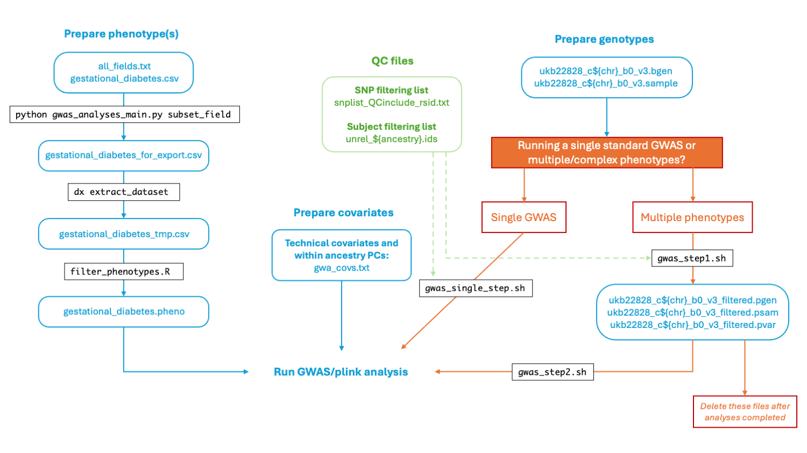

Author: Tanya Phung (t.n.phung@vu.nl)

This document is intended to guide how to do a GWAS on the UKB-RAP platform. For demonstration purpose, the trait I will be using is gestational diabetes (field ID 4041)

## Table of contents
1. [General information](#info)
2. [Schematics of steps to run GWAS](#schema)
3. [Step 1: Prepare phenotype file](#step1)
3. [Step 2: Prepare the genotype](#step2)
3. [Step 3: Run GWAS](#step3)

## General information <a name="info"></a>
- Genotype calls path on UKB-RAP: `/Bulk/Genotype Results/Genotype calls/`
- Field: 22418 (https://biobank.ndph.ox.ac.uk/showcase/field.cgi?id=22418)
- Types of files available: `.bed`, `.bim`, `.bam` per chromosome
- Which build of the reference? 
    - My best guess is that the build is in GRCh37
    - Downloaded the file `ukb_snp_bim.tar` from https://biobank.ndph.ox.ac.uk/showcase/refer.cgi?id=1963
    - Extract it and checking a few snp
        - For `21      rs149363218     0       10910400        CTA     C` : https://gnomad.broadinstitute.org/variant/21-10910400-CTA-C?dataset=gnomad_r2_1
        - For `21      rs116894217     0       14779793        G       A` : https://gnomad.broadinstitute.org/variant/21-14779793-G-A?dataset=gnomad_r2_1
        - For `12      rs7959779       0       149478  G       A` : https://gnomad.broadinstitute.org/variant/12-149478-G-A?dataset=gnomad_r2_1

## Schematics of steps to run GWAS <a name="schema"></a>


## Step 1: Prepare phenotype file <a name="step1"></a>
#### Step 1a: Prepare the input file to the `dx extract_dataset` command

- Script: `gwas_analyses_main.py`
- Required inputs: 
    - `all_fields.txt`
        - This file can be generated with the command: `dx extract_dataset {projectID}:{recordID} --list-fields > all_fields.txt`
    - A file (for example: `gestational_diabetes.csv`) where the header is `FieldID` and each row is the field ID. The first row should be `participant.eid`
    - Path to output file

- Example command:
    ```
    python gwas_analyses_main.py subset_field \
        --all_fields all_fields.txt \
        --fields_interest gestational_diabetes.csv \
        --outfile gestational_diabetes_for_export.txt 
    Subset the file all_fields.txt and format to be used as an input file to dx extract_dataset --fields-file
    ```

- Output of this script is `gestational_diabetes_for_export.txt`
```
cat gestational_diabetes_for_export.txt 
participant.eid
participant.p4041_i0
participant.p4041_i1
participant.p4041_i2
participant.p4041_i3
```

#### Step 1b: Run `dx extract_dataset` to extract data for each phenotype
```
dx extract_dataset {projectID}:{recordID} --fields-file gestational_diabetes_for_export.txt

# the output defaults to a file with name app16406_20250106164000.dataset.csv so we should rename it
mv app16406_20250106164000.dataset.csv gestational_diabetes_tmp.csv
```

#### Step 1c: Keep only individuals with data
- From https://biobank.ndph.ox.ac.uk/showcase/field.cgi?id=4041, I want to keep instance 0 and only when the response is No (0) or Yes (1)
- Rscript: `gwas_analyses/filter_phenotypes.R`. This script also converts values for cases from 1 to 2 and values for controls from 0 to 1

```
data = fread("gestational_diabetes_tmp.csv")

i0 = data %>% 
  filter(participant.p4041_i0==0 | participant.p4041_i0==1) %>%
  select(participant.eid, participant.p4041_i0) %>%
  mutate(IID = participant.eid) %>%
  select(participant.eid, IID, participant.p4041_i0)

colnames(i0) = c("FID", "IID", "GestationalDiabetes")

i0$GestationalDiabetes[i0$GestationalDiabetes == 1] <- 2
i0$GestationalDiabetes[i0$GestationalDiabetes == 0] <- 1

write.csv(i0, "gestational_diabetes.pheno", quote = F, row.names = F)
```
- Check to make sure that the number matches with the website: 
```
table(i0$GestationalDiabetes)

   1    2 
8473 1070 
```

## Step 2: Prepare the genotype <a name="step2"></a>
#### Step 2a: Convert bgen to pgen format
- Run: `./a_plink_convert_bgen_pgen.sh`
- Stats:

*notes:* for some chromosomes, the stats are empty because I am still in the process of running it


chrom | instance type | duration | cost
--- | --- | --- | --- 
1 | | | 
2 | | | 
3 | | | 
4 | | | 
5 | | | 
6 | | | 
7 | | | 
8 | | | 
9 | | | 
10 | | | 
11 | | | 
12 | | | 
13 | | | 
14 | | | 
15 | mem1_ssd1_v2_x8 | 49m | £0.1803
16 | | | 
17 | mem1_ssd1_v2_x8 | 47m | £0.1750
18 | mem1_ssd1_v2_x8 | 45m | £0.1671
19 | mem1_ssd1_v2_x8 | 40m | £0.1468
20 | mem1_ssd1_v2_x8 | 37m | £0.1360
21 | mem1_ssd1_v2_x8 | 23m | £0.0894
22 | mem1_ssd1_v2_x8 | 23m | £0.0925


#### Step 2b: Filter
- Run: `./b_plink_qc_imputed.sh`
- Stats: 

chrom | instance type | duration | cost
--- | --- | --- | --- 
22 | mem1_ssd1_v2_x2 | 21m | £0.0066

## Step 3: Run GWAS <a name="step3"></a>
- Run: `./c_gwas_plink_bt.sh`
- Stats: 

chrom | instance type | duration | cost
--- | --- | --- | --- 
22 | mem1_ssd1_v2_x2 | 21m | £0.0066