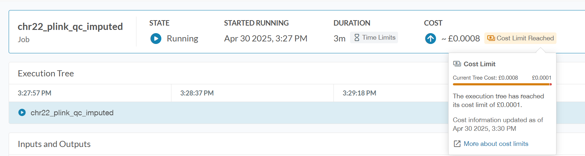

In this document, I am recording some behaviors of UKB-RAP that I experienced
1. --cost-limit
- From https://documentation.dnanexus.com/user/helpstrings-of-sdk-command-line-utilities: 
```
 --cost-limit cost_limit
                        Maximum cost of the job before termination. In case of
                        workflows it is cost of the entire analysis job. For
                        batch run, this limit is applied per job.
```

- I intepreted this to mean that if I set a cost limit and once the cost has exceeded that limit, the job would be terminated. However, this is not the case: 




Here, I set the cost limit to 0.0001 for testing. When it reached 0.0008, it correctly detected that the cost limit has been reached, but the job was not terminated. 

2. Job being stuck in out of memory error
- If the instance does not have enough memory to run your job, I would expect that the job is killed. 
- What I have observed is that, sometimes the specific process is killed due to out of memory error and that causes the job to also be killed. However, in some cases, the specific process that is killed did not trigger the job to be killed. The consequence of this is that my job was stucked forever until I manually terminate it. 
- As an example, in the log below, vcftools run out of memory but the job was still running and it was stuck in this state even 3 hours later
```
[Apr 28 2025, 9:41 PM] vcftools invoked oom-killer: gfp_mask=0x1100dca(GFP_HIGHUSER_MOVABLE|__GFP_ZERO), order=0, oom_score_adj=0
[Apr 28 2025, 9:41 PM] Out of memory: Killed process 7351 (dxfuse) total-vm:5967132kB, anon-rss:3711628kB, file-rss:4kB, shmem-rss:0kB, UID:100000 pgtables:8180kB oom_score_adj:0
[Apr 28 2025, 9:49 PM] CPU: 27% (4 cores) * Memory: 4630/7677MB * Storage: 6/97GB * Net: 5↓/0↑MBps
[Apr 28 2025, 9:59 PM] CPU: 27% (4 cores) * Memory: 4642/7677MB * Storage: 6/97GB * Net: 0↓/0↑MBps
[Apr 28 2025, 10:09 PM] CPU: 26% (4 cores) * Memory: 4645/7677MB * Storage: 6/97GB * Net: 0↓/0↑MBps
[Apr 28 2025, 10:19 PM] CPU: 27% (4 cores) * Memory: 4640/7677MB * Storage: 6/97GB * Net: 0↓/0↑MBps
[Apr 28 2025, 10:29 PM] CPU: 27% (4 cores) * Memory: 4639/7677MB * Storage: 6/97GB * Net: 0↓/0↑MBps
[Apr 28 2025, 10:39 PM] CPU: 27% (4 cores) * Memory: 4631/7677MB * Storage: 6/97GB * Net: 0↓/0↑MBps
[Apr 28 2025, 10:49 PM] CPU: 26% (4 cores) * Memory: 4637/7677MB * Storage: 6/97GB * Net: 0↓/0↑MBps
[Apr 28 2025, 10:59 PM] CPU: 27% (4 cores) * Memory: 4633/7677MB * Storage: 6/97GB * Net: 0↓/0↑MBps
[Apr 28 2025, 11:09 PM] CPU: 27% (4 cores) * Memory: 4637/7677MB * Storage: 6/97GB * Net: 0↓/0↑MBps
[Apr 28 2025, 11:19 PM] CPU: 26% (4 cores) * Memory: 4654/7677MB * Storage: 6/97GB * Net: 0↓/0↑MBps
[Apr 28 2025, 11:29 PM] CPU: 27% (4 cores) * Memory: 4626/7677MB * Storage: 6/97GB * Net: 0↓/0↑MBps
[Apr 28 2025, 11:39 PM] CPU: 26% (4 cores) * Memory: 4632/7677MB * Storage: 6/97GB * Net: 0↓/0↑MBps
[Apr 28 2025, 11:49 PM] CPU: 27% (4 cores) * Memory: 4644/7677MB * Storage: 6/97GB * Net: 0↓/0↑MBps
[Apr 28 2025, 11:59 PM] CPU: 26% (4 cores) * Memory: 4655/7677MB * Storage: 6/97GB * Net: 0↓/0↑MBps
[Apr 29 2025, 12:09 AM] CPU: 27% (4 cores) * Memory: 4625/7677MB * Storage: 6/97GB * Net: 0↓/0↑MBps
[Apr 29 2025, 12:19 AM] CPU: 26% (4 cores) * Memory: 4637/7677MB * Storage: 6/97GB * Net: 0↓/0↑MBps
[Apr 29 2025, 12:29 AM] CPU: 27% (4 cores) * Memory: 4652/7677MB * Storage: 6/97GB * Net: 0↓/0↑MBps
[Apr 29 2025, 12:39 AM] CPU: 26% (4 cores) * Memory: 4650/7677MB * Storage: 6/97GB * Net: 0↓/0↑MBps
[Apr 29 2025, 12:49 AM] CPU: 26% (4 cores) * Memory: 4627/7677MB * Storage: 6/97GB * Net: 0↓/0↑MBps
[Apr 29 2025, 12:59 AM] CPU: 27% (4 cores) * Memory: 4639/7677MB * Storage: 6/97GB * Net: 0↓/0↑MBps
```
- Using the same command to launch the exact same job, but this time, the job was killed immediately:
```
[Apr 29 2025, 9:23 PM] python3 invoked oom-killer: gfp_mask=0x1100cca(GFP_HIGHUSER_MOVABLE), order=0, oom_score_adj=-999
[Apr 29 2025, 9:23 PM] Out of memory: Killed process 8145 (vcftools) total-vm:4112492kB, anon-rss:3575892kB, file-rss:4kB, shmem-rss:0kB, UID:100000 pgtables:7112kB oom_score_adj:0
[Apr 29 2025, 10:04 PM] END_LOG
```

- Conclusion: it is important to monitor the job log and terminate if it is stuck to not waste resources. 